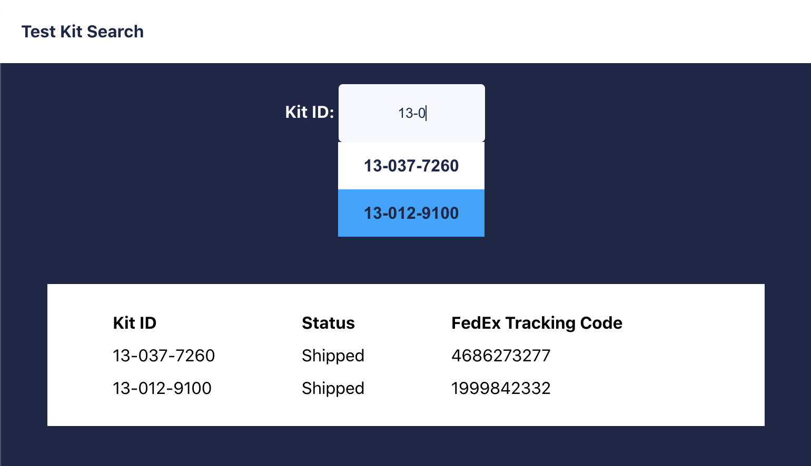

# Kit Search

Small app to display Biobot kit shipping data. Enter a partial or complete test kit ID to see shipment tracking details.
This project was bootstrapped with [Create React App](https://github.com/facebook/create-react-app).

## Getting Started
### To start the Express server, from the main project directory, run:
`node server.js`

You should see "Server listening on port: 8080"

### To start the React app, from the main project directory, run:
`npm start`

Open [http://localhost:3000](http://localhost:3000) to view it in your browser.

## Testing
`npm test`

Launches the test runner in the interactive watch mode for tests in `./src/_tests_`.\
Server tests cover API /search endpoint usage.\
Frontend tests are a TODO list item.

## Build
`npm run build`

Builds the app for production to the `build` folder.\
It correctly bundles React in production mode and optimizes the build for the best performance.

## ToDo
Future enhancements to improve maintenance, performance and scalability of app.
### Front end
* Full component testing

### Back end
* Real pagination of search results.
* Replace .json mock db with actual db.
